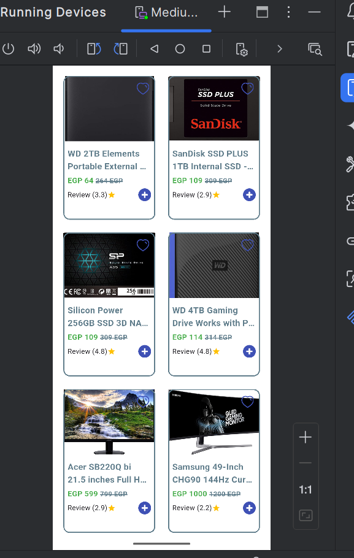

# FLUTTER CATALOG TASK:

## Screenshots

| Product List UI                              |
|----------------------------------------------|
|  |
                                                   Product Screen                                                   
:-----------------------------------------------------------------------------------------------------------------: |

## Directory Structure

     
 Click to expand 

lib
├── bloc
│   ├── home_cubit.dart
│   └── home_state.dart
├── models
│   └── card_model.dart
│       
├── screens
│   └── home_screen.dart
│ 
│── widget
│     └── card_item  
└──  main.dart
   

- [Lab: Write your first Flutter app](https://docs.flutter.dev/get-started/codelab)
- [Cookbook: Useful Flutter samples](https://docs.flutter.dev/cookbook)

For help getting started with Flutter development, view the
[online documentation](https://docs.flutter.dev/), which offers tutorials,
samples, guidance on mobile development, and a full API reference.
